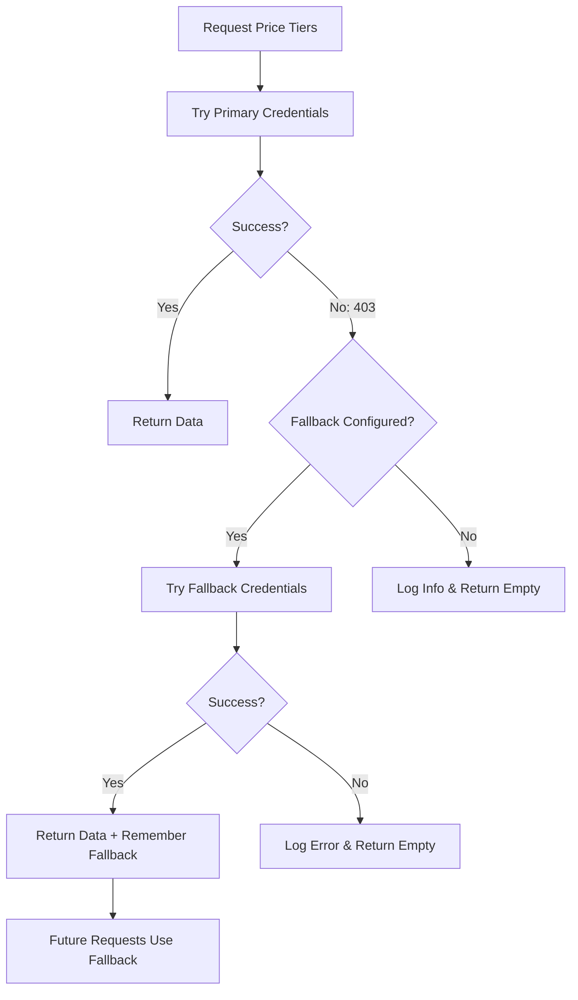

# Apple App Store Connect API - Fallback Credentials

## Overview

Some Apple App Store Connect API operations require specific permissions that may not be available with all API keys, even those with the Admin role. Specifically, accessing **price points** (`inAppPurchasePricePoints`) requires App Manager or Finance role permissions.

This application supports **fallback credentials** to handle scenarios where the primary API key lacks these specific permissions.

## When Fallback is Used

The application will automatically switch to fallback credentials when:
1. A `403 FORBIDDEN` error is returned for `inAppPurchasePricePoints`
2. The error indicates "no allowed operations defined"
3. Fallback credentials are properly configured

## Configuration

### Primary Credentials (Required)
```env
APP_STORE_ISSUER_ID=your-issuer-id-uuid
APP_STORE_KEY_ID=YOUR10CHAR
APP_STORE_PRIVATE_KEY_PATH=/path/to/AuthKey_PRIMARY.p8
APP_STORE_APP_ID=your-app-id
```

### Fallback Credentials (Optional)
```env
FALLBACK_APP_STORE_ISSUER_ID=your-issuer-id-uuid
FALLBACK_APP_STORE_KEY_ID=FALLBACK10
FALLBACK_APP_STORE_PRIVATE_KEY_PATH=/path/to/AuthKey_FALLBACK.p8
```

## How It Works

1. **Primary Credentials**: Used for all API operations by default
   - IAP listing
   - IAP creation/update/deletion
   - Localization management
   - Price point access (if permissions allow)

2. **Automatic Fallback**: When accessing price points
   - First attempt with primary credentials
   - If 403 error occurs, automatically retries with fallback credentials
   - Subsequent price point requests use fallback credentials
   - Other operations continue using primary credentials

3. **Logging**:
   ```
   [INFO] Price points access forbidden with primary credentials. 
          Switching to fallback credentials (App Manager/Finance role).
   ```

## API Key Role Requirements

### Primary Key (Minimum: Admin or App Manager)
- ✅ List IAPs
- ✅ Create/Update/Delete IAPs
- ✅ Manage localizations
- ❌ Access price points (may require App Manager/Finance)

### Fallback Key (Recommended: App Manager or Finance)
- ✅ Access price points
- ✅ Query pricing tiers
- ✅ All operations supported by App Manager role

## Setup Instructions

### 1. Generate Primary API Key (Admin Role)
1. Log in to [App Store Connect](https://appstoreconnect.apple.com/)
2. Go to **Users and Access** → **Keys**
3. Click **+** to generate a new key
4. Name it (e.g., "IAP Management Primary")
5. Select **Admin** role
6. Download the `.p8` file
7. Note the **Key ID** and **Issuer ID**

### 2. Generate Fallback API Key (App Manager/Finance Role)
1. In **Users and Access** → **Keys**
2. Click **+** to generate another key
3. Name it (e.g., "IAP Management Fallback - Price Points")
4. Select **App Manager** or **Finance** role
5. Download the `.p8` file
6. Note the **Key ID** (will be different from primary)
7. **Issuer ID** remains the same

### 3. Configure Environment Variables
```bash
# Primary credentials
export APP_STORE_ISSUER_ID="12345678-1234-1234-1234-123456789012"
export APP_STORE_KEY_ID="ABCDEF1234"
export APP_STORE_PRIVATE_KEY_PATH="/path/to/AuthKey_ABCDEF1234.p8"
export APP_STORE_APP_ID="1234567890"

# Fallback credentials (for price points)
export FALLBACK_APP_STORE_ISSUER_ID="12345678-1234-1234-1234-123456789012"  # Same as primary
export FALLBACK_APP_STORE_KEY_ID="GHIJKL5678"  # Different key
export FALLBACK_APP_STORE_PRIVATE_KEY_PATH="/path/to/AuthKey_GHIJKL5678.p8"
```

## Behavior Without Fallback

If fallback credentials are not configured and price points access is forbidden:
- The application continues to work normally
- Price tier information will not be available
- Logs will show informational message (not an error)
- IAP management functions are unaffected

## Security Considerations

1. **Separate Keys**: Use different keys for primary and fallback
2. **Minimum Permissions**: Only grant what's needed for each key
3. **Key Rotation**: Regularly rotate both keys
4. **File Permissions**: Protect `.p8` files with appropriate file permissions
   ```bash
   chmod 600 /path/to/AuthKey_*.p8
   ```

## Troubleshooting

### Fallback Not Working
Check logs for:
```
[WARNING] Fallback credentials not configured, using primary credentials
```
→ Verify all three fallback environment variables are set

### Both Keys Failing
```
[ERROR] Fallback credentials also failed: ...
```
→ Verify fallback key has App Manager or Finance role

### Wrong Issuer ID
```
AppleStoreConfigError: FALLBACK_APP_STORE_ISSUER_ID 값이 올바른 UUID 형식이 아닙니다.
```
→ Issuer ID must be a valid UUID format

## Example: Price Tier Query Flow



## Notes

- Fallback is **automatic** - no manual intervention needed
- Once fallback is used, it's remembered for the session
- Only price point operations use fallback
- All other operations always use primary credentials
- The Issuer ID is typically the same for both keys (from the same organization)

